# Mock Servis Mimarisi

Bu belge, `CreditCase.Infrastructure.Services` altında konumlanan mock ve hesaplama servislerinin **ne yaptığını**, **nasıl çalıştığını** ve birbirleriyle **nasıl etkileşime girdiğini** ayrıntılı olarak açıklar.

---

## İçindekiler

1. [Genel Akış](#genel-akış)
2. [MockCreditScoreService](#mockcreditscoreservice)
3. [RiskAnalysisEngine](#riskanalysisengine)
4. [InterestCalculationEngine](#interestcalculationengine)
5. [MaximumLoanCalculator](#maximumloancalculator)
6. [StandardInstallmentStrategy](#standardinstallmentstrategy)
7. [BalloonPaymentStrategy](#balloonpaymentstrategy)
8. [Servisler Arası Veri Akışı](#servisler-arası-veri-akışı)
9. [Örnek Uçtan Uca Hesaplama](#örnek-uçtan-uca-hesaplama)

---

## Genel Akış

Bir kredi başvurusu değerlendirilirken servisler şu sırayla devreye girer:

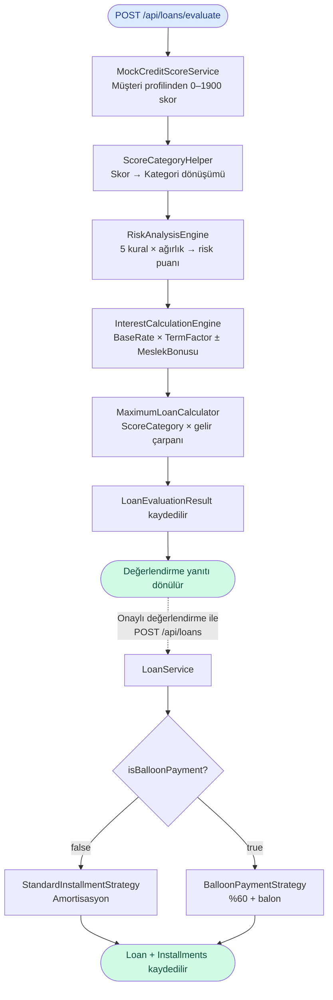

---

## MockCreditScoreService

**Dosya:** `CreditCase.Infrastructure/Services/MockCreditScoreService.cs`  
**Interface:** `ICreditScoreService` (Application katmanında tanımlı)

### Amaç

Gerçek bir kredi bürosu API'sinin yerini tutan mock implementasyon. Rastgele değer üretmek yerine **müşterinin gerçek profilinden deterministik skor hesaplar** — aynı profil her zaman aynı skoru verir.

### Skor Hesaplama

Skor dört bileşenin toplamıdır (baz maks. = **1700**):

```
Nihai Skor = Clamp(Yaş + Gelir + İstihdam + Meslek + CreditScoreBonus, 0, 1900)
```

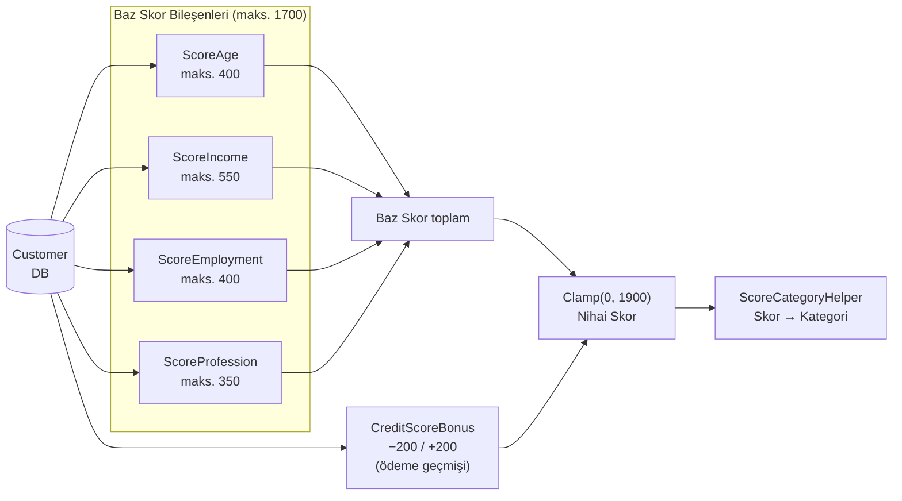

### Bileşen Tabloları

**Yaş Puanı (maks. 400) — 36–50 yaş pik dönem:**

| Yaş | Puan | Gerekçe |
|---|---|---|
| < 21 | 80 | Kredi geçmişi yok |
| 21–25 | 200 | Genç yetişkin |
| 26–35 | 320 | Kariyer başlangıcı |
| 36–50 | **400** | Pik — istikrarlı kariyer, gelir doruk |
| 51–60 | 350 | Olgun, düşük değişim riski |
| 61–65 | 240 | Emeklilik yaklaşıyor |
| > 65 | 110 | Emekli sonrası düşen gelir riski |

**Gelir Puanı (maks. 550) — Türkiye gelir bantları:**

| Aylık Gelir | Puan |
|---|---|
| < 3.000 ₺ | 60 |
| 3.000–5.999 ₺ | 170 |
| 6.000–9.999 ₺ | 290 |
| 10.000–19.999 ₺ | 410 |
| 20.000–49.999 ₺ | 495 |
| ≥ 50.000 ₺ | 550 |

**İstihdam Puanı (maks. 400):**

| Durum | Puan | Açıklama |
|---|---|---|
| Tam Zamanlı | 400 | Düzenli gelir garantisi |
| Emekli | 340 | Sabit emekli maaşı |
| Serbest Meslek | 260 | Gelir değişkenliği var |
| Yarı Zamanlı | 200 | Kısmi gelir güvencesi |
| İşsiz | 40 | Gelir kaynağı belirsiz |

**Meslek Puanı (maks. 350):**

| Meslek | Puan | Açıklama |
|---|---|---|
| Kamu | 350 | En yüksek iş güvencesi |
| Sağlık | 315 | Profesyonel, yüksek talep |
| Finans | 295 | Yüksek gelir sektörü |
| Eğitim | 280 | Kamu avantajı |
| Teknoloji | 280 | Yüksek gelir sektörü |
| Ticaret | 220 | Değişken ama yaygın |
| Hizmetler | 195 | Orta istikrar |
| Diğer | 175 | Tanımsız profil |
| İnşaat | 150 | Mevsimsel risk |
| Mevsimlik | 90 | En yüksek gelir belirsizliği |

### ScoreCategory Eşlemesi

Nihai skor beş kategoriden birine düşer:

| Skor Aralığı | Kategori | RiskIndicator | DefaultProbability | NegativeRecords |
|---|---|---|---|---|
| 1720–1900 | **Prestijli** | Low | 0.02 | Yok |
| 1470–1719 | **Guvenli** | Low | 0.05 | Yok |
| 1150–1469 | **Dengeli** | Medium | 0.12 | Yok |
| 970–1149 | **GelisimeAcik** | High | 0.25 | Payment Late kaydı |
| 0–969 | **Kritik** | VeryHigh | 0.45 | Payment Late kaydı |

> `NegativeRecords` skor 1150'nin altına düştüğünde otomatik olarak 6 ay öncesine tarihlenmiş bir gecikme kaydı içerir.

### CreditScoreBonus Dinamiği

`Customer.CreditScoreBonus` alanı her başarılı ödeme sonrası güncellenir ve kalıcı olarak saklanır. Bir sonraki değerlendirmede baz skora eklenir:

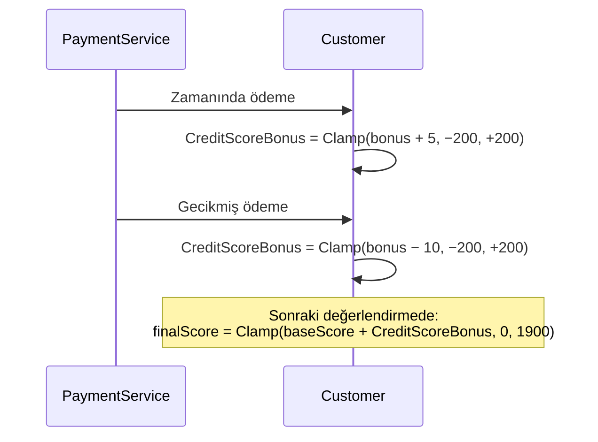

**Maksimum etkisi:** 40 düzenli ödeme → +200 bonus (+200 puan) — bir kategori atlamaya yetebilir.  
**Minimum sınır:** Sürekli gecikme → −200 bonus, kategori düşebilir.

---

## RiskAnalysisEngine

**Dosya:** `CreditCase.Infrastructure/Services/RiskAnalysisEngine.cs`  
**Interface:** `IRiskAnalysisService`

### Amaç

5 bağımsız risk kuralını ağırlıklı olarak toplayarak müşterinin genel risk puanını (0–100) hesaplar. Bu puan `RiskCategory` (Low / Medium / High / VeryHigh) belirler.

### Mimari — Open/Closed Prensibi

Her kural `IRiskAnalysisRule` interface'ini implement eder. Motor, kural listesini DI üzerinden alır:

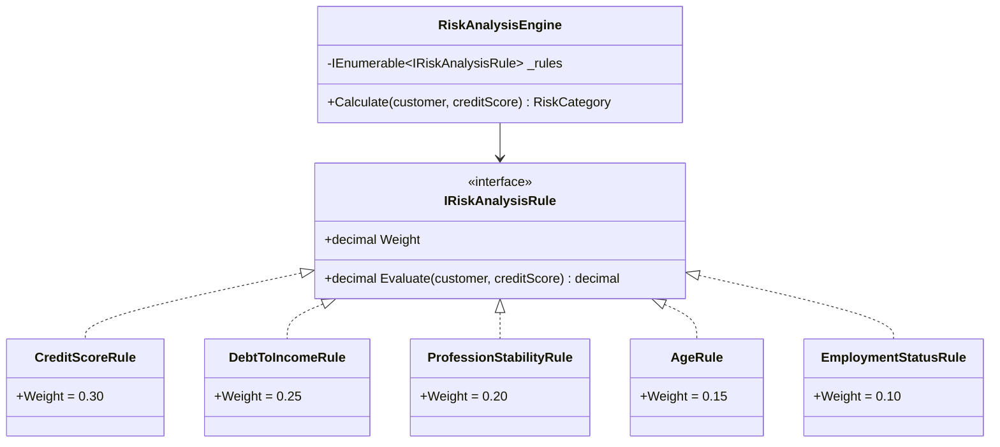

Yeni bir risk kuralı eklemek mevcut kodu değiştirmez — sadece yeni bir sınıf yazılır ve DI'a kaydedilir.

### Kural Ağırlıkları ve Puan Kaynakları

```
Toplam Puan = Σ (Kural[i].Evaluate() × Kural[i].Weight)
```

| Kural | Ağırlık | Puan Mantığı |
|---|---|---|
| `CreditScoreRule` | **0.30** | `creditScore / 19` (0–1900 → 0–100 normalize) |
| `DebtToIncomeRule` | **0.25** | Borç/Gelir oranı bantları |
| `ProfessionStabilityRule` | **0.20** | Meslek kategorisi stabilite skoru |
| `AgeRule` | **0.15** | Yaş bantları (36–50 = 100 puan) |
| `EmploymentStatusRule` | **0.10** | İstihdam durumu skoru |

### Risk Kategorisi Eşlemesi

| Toplam Puan | RiskCategory |
|---|---|
| ≥ 75 | **Low** |
| ≥ 55 | **Medium** |
| ≥ 35 | **High** |
| < 35 | **VeryHigh** — başvuru otomatik reddedilir |

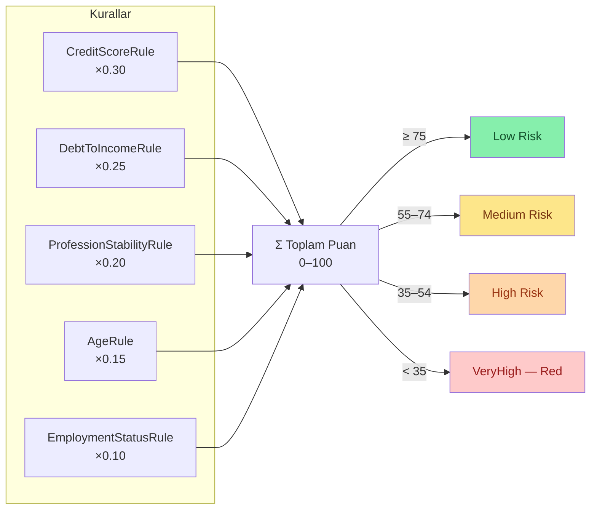

> **Not:** `RiskCategory` (Low/Medium/High/VeryHigh) `LoanEvaluationResult.RiskLevel` alanında saklanır. Vade oranı hesaplaması ise `ScoreCategory` (5 değerli) kullanır — iki sistem bağımsız çalışır, `ScoreCategoryHelper.ToRiskCategory()` köprü görevi görür.

---

## InterestCalculationEngine

**Dosya:** `CreditCase.Infrastructure/Services/InterestCalculationEngine.cs`  
**Interface:** `IInterestCalculationService`

### Amaç

Müşterinin `ScoreCategory`'sine, talep edilen kredi türüne, vade süresine ve meslek/istihdam durumuna göre **vade oranını** (ratio formatında) hesaplar.

> **Önemli:** Sonuç yüzde (`%`) değil, **ratio**'dur. `3.25` yazan yerde "%3.25 vade farkı" değil, "3.25 vade oranı" okunur. Bu, uluslararası fintech standartlarına uygun profesyonel gösterimdir.

### 3 Aşamalı Hesaplama

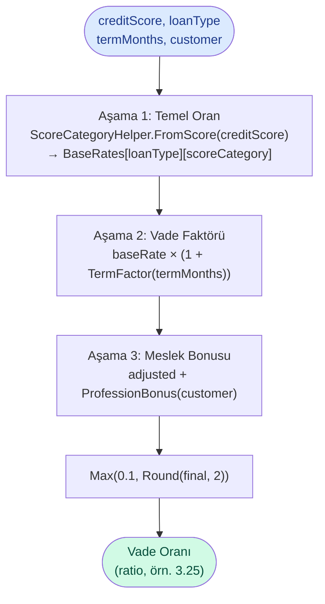

### Aşama 1 — Temel Vade Oranı Tablosu (12 ay referans)

| | Kritik | GelisimeAcik | Dengeli | Guvenli | Prestijli |
|---|:---:|:---:|:---:|:---:|:---:|
| **Bireysel** | 6.8 | 5.2 | 4.0 | 3.0 | 2.0 |
| **Taşıt** | 5.8 | 4.2 | 3.0 | 2.0 | 1.2 |
| **Eğitim** | 5.2 | 3.8 | 2.7 | 1.7 | 0.9 |

Bu tablo 12 ay vade için referans oranları gösterir. Vade değiştikçe oran dinamik olarak ayarlanır.

### Aşama 2 — Vade Faktörü

Vade arttıkça belirsizlik artar ve oran yükselir; kısa vadede ise indirim uygulanır:

| Vade | Faktör | Açıklama |
|---|:---:|---|
| ≤ 6 ay | **−0.25** | Kısa vade indirimi |
| ≤ 12 ay | **0.00** | Referans (değişim yok) |
| ≤ 18 ay | **+0.08** | Hafif artış |
| ≤ 24 ay | **+0.15** | |
| ≤ 36 ay | **+0.28** | |
| ≤ 48 ay | **+0.42** | |
| ≤ 60 ay | **+0.58** | |
| ≤ 72 ay | **+0.75** | En yüksek — maksimum vade |

```
Vade Uygulanmış Oran = TemelOran × (1 + Faktör)

Örnek: Dengeli, Bireysel, 24 ay
= 4.0 × (1 + 0.15) = 4.0 × 1.15 = 4.60
```

### Aşama 3 — Meslek / İstihdam Bonusu

| Meslek / Durum | Bonus | Yön |
|---|:---:|---|
| Kamu Personeli | −0.30 | İndirim — en yüksek iş güvencesi |
| Sağlık | −0.20 | İndirim |
| Teknoloji | −0.20 | İndirim |
| Eğitim | −0.15 | İndirim |
| Finans | −0.10 | İndirim |
| Ticaret | +0.20 | Penaltı — değişken gelir |
| İnşaat | +0.20 | Penaltı — mevsimsel risk |
| Mevsimlik | +0.30 | Penaltı — en yüksek risk |
| Serbest Meslek (EmploymentStatus) | min. +0.30 | Meslek bonusundan bağımsız ek risk |

> `Freelance` istihdamı meslek kategorisinden bağımsız olarak en az +0.30 penaltı uygular: `bonus = Math.Max(bonus, 0.3m)`. Böylece hem meslek kategorisi hem istihdam durumu değerlendirmeye katılır.

```
Final = Max(0.1, Round(VadeUygulanmışOran + MeslekBonusu, 2))
```

### Hesaplama Örneği — Tam Adımlar

**Yazılımcı, Guvenli kategori, Bireysel kredi, 24 ay:**

```
Aşama 1 — Temel Oran:
  ScoreCategory = Guvenli
  BaseRates[Bireysel][Guvenli] = 3.0

Aşama 2 — Vade Faktörü:
  TermFactor(24) = +0.15
  3.0 × (1 + 0.15) = 3.0 × 1.15 = 3.45

Aşama 3 — Meslek Bonusu:
  ProfessionCategory = Teknoloji → −0.20
  EmploymentStatus   = Active (Tam Zamanlı) → ek etki yok

Final: 3.45 + (−0.20) = 3.25
```

---

## MaximumLoanCalculator

**Dosya:** `CreditCase.Infrastructure/Services/MaximumLoanCalculator.cs`  
**Interface:** `IMaximumLoanCalculatorService`

### Amaç

Müşterinin `ScoreCategory`'sine ve mevcut borç yüküne göre alabileceği **maksimum kredi tutarını** hesaplar.

### Hesaplama Mantığı

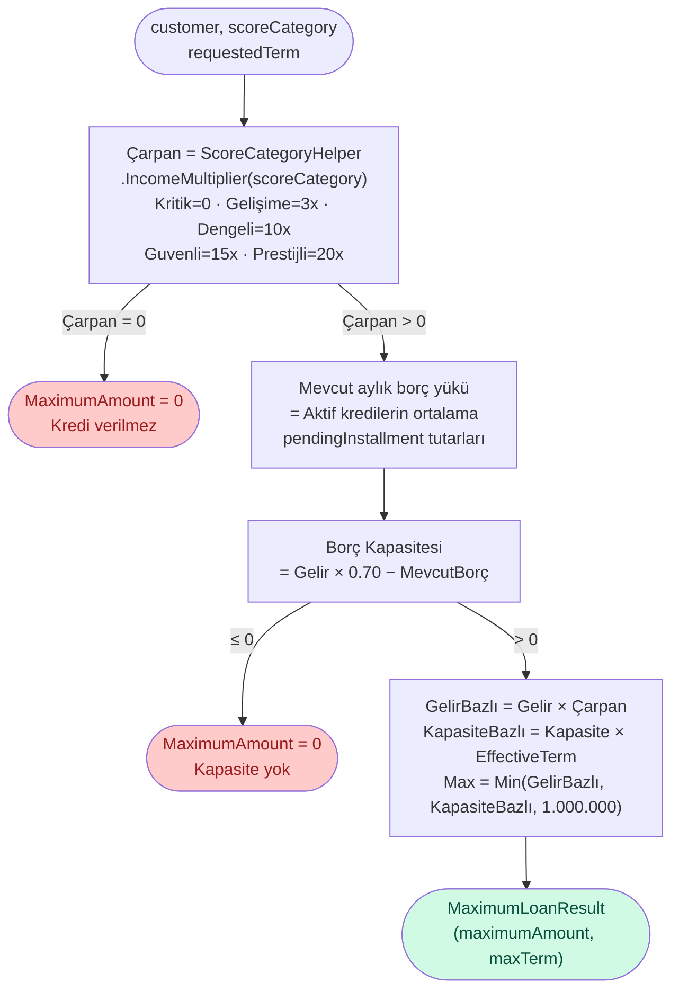

### ScoreCategory Parametreleri

| Kategori | Gelir Çarpanı | Maks. Vade | Min. Taksit |
|---|:---:|:---:|:---:|
| Kritik | **0×** (red) | 24 ay | — |
| GelisimeAcik | **3×** | 36 ay | 25.000 ₺ |
| Dengeli | **10×** | 48 ay | 15.000 ₺ |
| Guvenli | **15×** | 60 ay | 10.000 ₺ |
| Prestijli | **20×** | 72 ay | 5.000 ₺ |

### Hesaplama Örneği

```
Müşteri: Guvenli, 8.000 ₺/ay gelir, aktif kredi ödemesi 0
requestedTerm: 24 ay

Çarpan = 15 (Guvenli)
MaxTerm = 60 ay

BorçKapasitesi = 8.000 × 0.70 − 0 = 5.600 ₺/ay
EffectiveTerm  = Min(24, 60) = 24 ay

GelirBazlı     = 8.000 × 15 = 120.000 ₺
KapasiteBazlı  = 5.600 × 24 = 134.400 ₺

MaximumAmount  = Min(120.000, 134.400, 1.000.000) = 120.000 ₺
```

---

## StandardInstallmentStrategy

**Dosya:** `CreditCase.Infrastructure/Services/StandardInstallmentStrategy.cs`  
**Interface:** `IInstallmentPlanStrategy` (`SupportsBalloon = false`)

### Amaç

Onaylanan kredinin taksit planını **amortisasyon (azalan bakiye) yöntemiyle** üretir. Her taksit eşit tutardadır; ancak içindeki anapara/vade farkı paylaşımı değişir.

### Amortisasyon Formülü

```
r = rateAmount / 100 / 12     (yıllık ratio → aylık oran)

A = P × [r × (1 + r)^n] / [(1 + r)^n − 1]

P = Anapara (kredi tutarı)
r = Aylık oran
n = Vade (ay)
A = Sabit aylık taksit tutarı
```

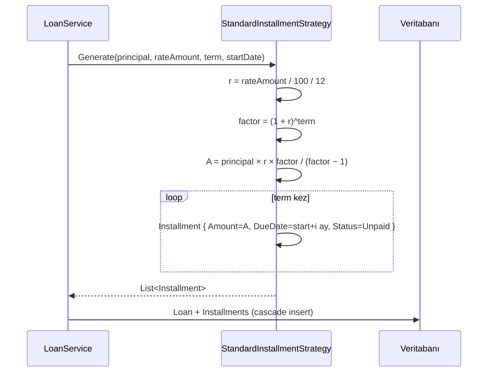

### Somut Örnek — 50.000 ₺, Vade Oranı 3.25, 24 ay

```
r = 3.25 / 100 / 12 = 0.002708...
factor = (1.002708...)^24 = 1.06671...

A = 50.000 × 0.002708... × 1.06671... / (1.06671... − 1)
A = 50.000 × 0.002888... / 0.06671...
A ≈ 2.164 ₺/ay

Taksit 1:  2.164 ₺  (Ana para: ~2.029 ₺,  Oran payı: ~135 ₺)
Taksit 2:  2.164 ₺  (Ana para: ~2.035 ₺,  Oran payı: ~129 ₺)
...
Taksit 24: 2.164 ₺  (Ana para: ~2.158 ₺,  Oran payı: ~6 ₺)

Toplam Ödeme: 24 × 2.164 = 51.936 ₺
Toplam Ek Ödeme: 51.936 − 50.000 = 1.936 ₺
```

Amortisasyonun başlangıçta vade farkı payı yüksek, anapara payı düşük olması normaldir; vade ilerledikçe bu oran tersine döner.

### RemainingPrincipal Güncellemesi

Her başarılı ödemeden sonra `PaymentService` kalan bakiyeyi yeniden hesaplar:

```csharp
loan.RemainingPrincipal = loan.Installments
    .Where(i => i.Status != InstallmentStatus.Paid)
    .Sum(i => i.Amount);
```

Bu yaklaşım gerçek kalan ödeme yükümlülüğünü (vade farkı dahil) yansıtır.

---

## BalloonPaymentStrategy

**Dosya:** `CreditCase.Infrastructure/Services/BalloonPaymentStrategy.cs`  
**Interface:** `IInstallmentPlanStrategy` (`SupportsBalloon = true`)

### Amaç

İlk taksitlerde ödeme yükünü azaltmak için tasarlanmış özel bir geri ödeme modeli. İlk `n-1` taksit standart tutarın **%60**'ı, son taksit ("balon") kalan borcun tamamıdır.

### Kısıtlamalar

- Yalnızca **Taşıt** (`Vehicle`) kredilerinde seçilebilir.
- Balon tutarı anaparanın **%50**'sini aşarsa `BusinessRuleException` fırlatılır.

### Hesaplama

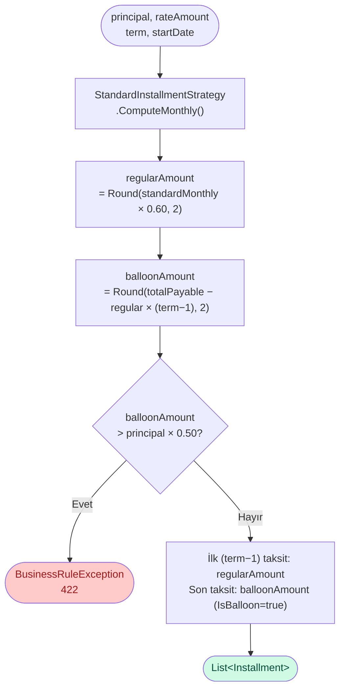

### Standart vs. Balon Karşılaştırması

**Senaryo:** 50.000 ₺ · Vade Oranı 2.0 · 12 ay

```
Standart:
  Aylık Taksit ≈ 4.232 ₺ × 12 = 50.784 ₺ toplam

Balon Ödemeli:
  Regular = Round(4.232 × 0.60, 2) = 2.539 ₺/ay × 11 = 27.929 ₺
  Balon   = 50.784 − 27.929 = 22.855 ₺ (son ay)
  Toplam  = 50.784 ₺ (aynı)

  Kontrol: 22.855 ≤ 50.000 × 0.50 = 25.000 ✓
```

```mermaid
gantt
    title Standart vs Balon Ödeme (50.000 ₺, 2.0 oran, 12 ay)
    dateFormat MM
    axisFormat Ay %m

    section Standart
    4.232 ₺/ay (×12) :01, 12M

    section Balon
    2.539 ₺/ay (×11) :01, 11M
    22.855 ₺ balon   :12, 1M
```

**Avantaj:** Müşteri ilk 11 ay düşük ödeme yapar; son ay yüksek bir ödeme gelir (beklenen tasarruf veya dış finansmanla karşılanacak şekilde planlanır).

---

## Servisler Arası Veri Akışı

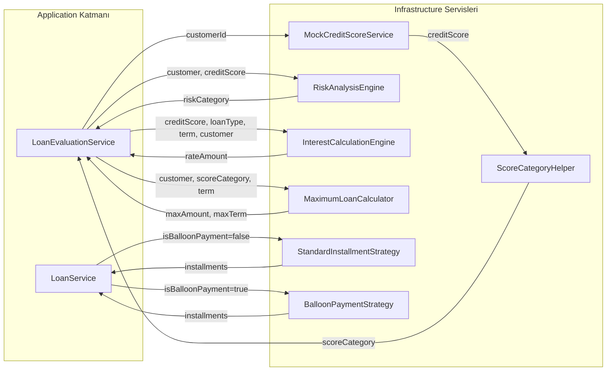

---

## Örnek Uçtan Uca Hesaplama

**Müşteri Profili:**
- Meslek: Teknoloji (Yazılım Mühendisi)
- İstihdam: Tam Zamanlı
- Yaş: 32
- Aylık Gelir: 15.000 ₺
- Mevcut Borç Ödemesi: 0
- CreditScoreBonus: +20 (daha önce düzenli ödeme yapmış)

**Talep:**
- Kredi Türü: Bireysel
- İstenen Tutar: 80.000 ₺
- İstenen Vade: 36 ay

---

### Adım 1 — MockCreditScoreService

```
Yaş Puanı (32)      = 320
Gelir Puanı (15.000) = 410
İstihdam Puanı (Active) = 400
Meslek Puanı (Teknoloji) = 280
────────────────────────────────
Baz Skor             = 1.410
CreditScoreBonus     = +20
────────────────────────────────
Nihai Skor = Clamp(1.430, 0, 1900) = 1.430 → Dengeli Kategorisi
```

### Adım 2 — ScoreCategoryHelper

```
1.430 → Dengeli (1150–1469)
  MaxTerm = 48 ay
  Çarpan  = 10×
  MinInstallment = 15.000 ₺
  ToRiskCategory = Medium
```

### Adım 3 — RiskAnalysisEngine

```
CreditScoreRule (×0.30)       = (1430/19) × 0.30 = 75.26 × 0.30 = 22.58
DebtToIncomeRule (×0.25)      = 0 borç → ~100 × 0.25 = 25.00
ProfessionStabilityRule (×0.20) = Teknoloji → ~85 × 0.20 = 17.00
AgeRule (×0.15)               = 32 yaş → ~80 × 0.15 = 12.00
EmploymentStatusRule (×0.10)  = Active → 100 × 0.10 = 10.00
──────────────────────────────────────────────────────────────────
Toplam Puan = 86.58 → Low Risk (≥ 75)
RiskCategory = Low
```

### Adım 4 — InterestCalculationEngine

```
Aşama 1 — Temel Oran:
  BaseRates[Bireysel][Dengeli] = 4.0

Aşama 2 — Vade Faktörü:
  TermFactor(36) = +0.28
  4.0 × (1 + 0.28) = 4.0 × 1.28 = 5.12

Aşama 3 — Meslek Bonusu:
  Teknoloji → −0.20
  Active (Tam Zamanlı) → ek etki yok

Vade Oranı = Round(5.12 − 0.20, 2) = 4.92
```

### Adım 5 — MaximumLoanCalculator

```
Çarpan = 10 (Dengeli)
EffectiveTerm = Min(36, 48) = 36 ay
BorçKapasitesi = 15.000 × 0.70 − 0 = 10.500 ₺/ay

GelirBazlı    = 15.000 × 10 = 150.000 ₺
KapasiteBazlı = 10.500 × 36 = 378.000 ₺
MaximumAmount = Min(150.000, 378.000, 1.000.000) = 150.000 ₺
```

### Adım 6 — Değerlendirme Kararı

```
İstenen Tutar: 80.000 ₺ ≤ MaximumAmount: 150.000 ₺ ✓
İstenen Vade:  36 ay ≤ MaxTerm: 48 ay ✓
RiskCategory:  Low (VeryHigh değil) ✓

MinInstallmentCheck:
  r = 4.92 / 100 / 12 = 0.0041
  A = 80.000 × amortize(...) ≈ 2.465 ₺/ay
  2.465 < 15.000 (MinInstallment) → UYARI: Taksit sınırı altında

→ ONAY REDDEDİLDİ (Taksit minimum sınırı altında)
  RejectionReason: "Tahmini aylık taksit, bu kategori için minimum taksit tutarının altındadır."
```

> **Pratik önerim:** Sistem bu durumda tutarı 100.000 ₺'ye çıkarmayı veya vadeyi 48 aya uzatmayı önerirdi — bu mantık `LoanEvaluationService` içinde `MaximumAmount` olarak zaten hesaplanmıştır.

### Adım 7 — StandardInstallmentStrategy (kredi onaylanmış olsaydı)

```
r = 4.92 / 100 / 12 = 0.0041
A = 80.000 × amortize(r, 36) ≈ 2.465 ₺/ay

Taksit 1:  2.465 ₺  (Ana para: ~2.137 ₺, Oran payı: ~328 ₺)
...
Taksit 36: 2.465 ₺  (Ana para: ~2.455 ₺, Oran payı: ~10 ₺)

Toplam Ödeme: 36 × 2.465 = 88.740 ₺
Toplam Ek Ödeme: 88.740 − 80.000 = 8.740 ₺
```
