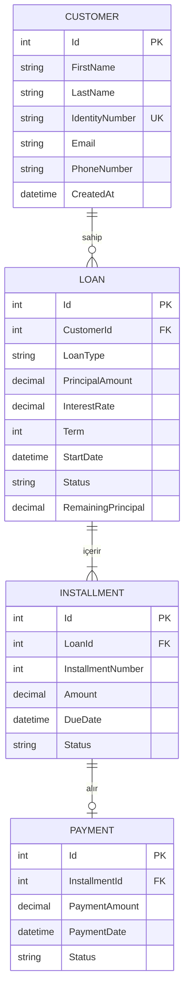
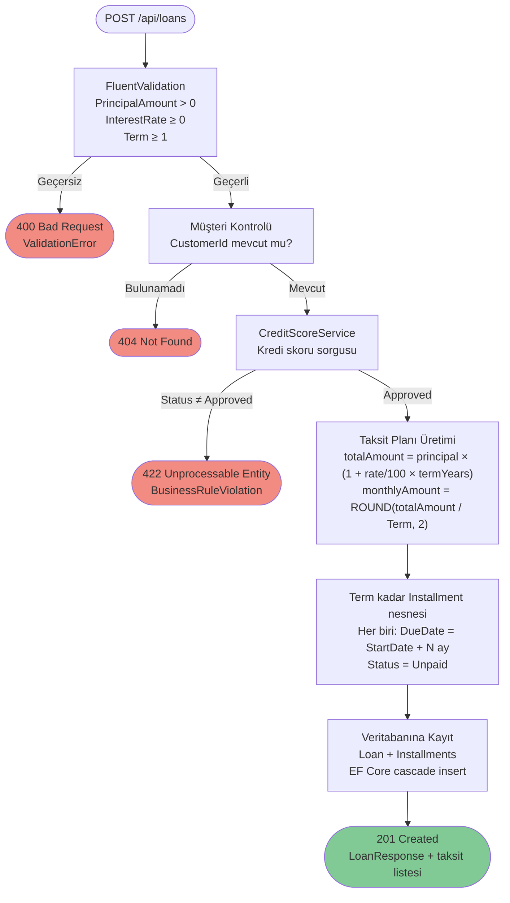

# Digital Loan & Repayment Management System

Bireysel müşterilerin kredi başvurularını, kredi bakiyelerini ve geri ödeme planlarını yönetebildiği dijital bankacılık backend uygulaması.

---

## İçindekiler

1. [Teknoloji Stack'i](#teknoloji-stacki)
2. [Mimari](#mimari)
3. [Proje Yapısı](#proje-yapısı)
4. [Domain Modeli](#domain-modeli)
5. [ER Diyagramı](#er-diyagramı)
6. [İş Kuralları](#iş-kuralları)
7. [Faiz Hesaplama](#faiz-hesaplama)
8. [Kredi Oluşturma Akışı](#kredi-oluşturma-akışı)
9. [API Endpoint Listesi](#api-endpoint-listesi)
10. [Hata Yönetimi](#hata-yönetimi)
11. [Üçüncü Parti Servis Entegrasyonu](#üçüncü-parti-servis-entegrasyonu)
12. [Kurulum ve Çalıştırma](#kurulum-ve-çalıştırma)
13. [Geliştirme Adımları](#geliştirme-adımları)
14. [Yapay Zeka Kullanımı](#yapay-zeka-kullanımı)

---

## Teknoloji Stack'i

| Katman | Teknoloji |
|---|---|
| Framework | .NET 10 / ASP.NET Core Web API |
| Dil | C# |
| ORM | Entity Framework Core 10 |
| Veritabanı | Microsoft SQL Server 2022 |
| Validasyon | FluentValidation 11 |
| API Dokümantasyonu | Swagger / OpenAPI (Swashbuckle) |
| Container | Docker |
| Versiyon Kontrolü | Git — Conventional Commits |

---

## Mimari

Projede **Clean Architecture** yaklaşımı uygulanmıştır. Katmanlar yalnızca içe doğru bağımlılık kurar; dış katmanlar iç katmanları referans alır, tersi geçerli değildir.

```
┌─────────────────────────────────────────────────────┐
│                   CreditCase.Api                    │
│         Controllers │ Middleware │ Program.cs       │
│                                                     │
│  ┌───────────────────────────────────────────────┐  │
│  │           CreditCase.Application              │  │
│  │   Services │ DTOs │ Interfaces │ Validators   │  │
│  │                                               │  │
│  │  ┌─────────────────────────────────────────┐  │  │
│  │  │          CreditCase.Domain              │  │  │
│  │  │      Entities │ Enums │ Business Rules  │  │  │
│  │  └─────────────────────────────────────────┘  │  │
│  └───────────────────────────────────────────────┘  │
│                                                     │
│  ┌───────────────────────────────────────────────┐  │
│  │         CreditCase.Infrastructure             │  │
│  │  AppDbContext │ Repositories │ Mock Services  │  │
│  └───────────────────────────────────────────────┘  │
└─────────────────────────────────────────────────────┘
```

### Bağımlılık Kuralı

```
Api  →  Application  →  Domain
Infrastructure  →  Application  →  Domain
```

`Domain` hiçbir dış katmana bağımlı değildir. `Application`, yalnızca `Domain`'i tanır. `Infrastructure`, `Application` interface'lerini implement eder; bu sayede gerçek EF Core implementasyonu uygulama katmanından gizlenir.

---

## Proje Yapısı

```
CreditCase.sln
│
├── CreditCase.Domain/
│   ├── Entities/
│   │   ├── Customer.cs
│   │   ├── Loan.cs
│   │   ├── Installment.cs
│   │   └── Payment.cs
│   └── Enums/
│       ├── LoanType.cs
│       ├── LoanStatus.cs
│       ├── InstallmentStatus.cs
│       └── PaymentStatus.cs
│
├── CreditCase.Application/
│   ├── DTOs/
│   │   ├── Customers/   (CreateCustomerRequest, UpdateCustomerRequest, CustomerResponse)
│   │   ├── Loans/       (CreateLoanRequest, LoanResponse)
│   │   ├── Installments/(UpdateInstallmentRequest, InstallmentResponse)
│   │   └── Payments/    (CreatePaymentRequest, PaymentResponse)
│   ├── Interfaces/
│   │   ├── Repositories/(ICustomerRepository, ILoanRepository, ...)
│   │   ├── Services/    (ICustomerService, ILoanService, ...)
│   │   └── External/    (ICreditScoreService)
│   ├── Services/
│   │   ├── CustomerService.cs
│   │   ├── LoanService.cs
│   │   ├── InstallmentService.cs
│   │   └── PaymentService.cs
│   ├── Validators/
│   │   ├── CreateCustomerRequestValidator.cs
│   │   ├── CreateLoanRequestValidator.cs
│   │   └── CreatePaymentRequestValidator.cs
│   ├── Exceptions/
│   │   ├── NotFoundException.cs
│   │   └── BusinessRuleException.cs
│   └── DependencyInjection.cs
│
├── CreditCase.Infrastructure/
│   ├── Persistence/
│   │   ├── AppDbContext.cs
│   │   └── Repositories/
│   │       ├── CustomerRepository.cs
│   │       ├── LoanRepository.cs
│   │       ├── InstallmentRepository.cs
│   │       └── PaymentRepository.cs
│   ├── Services/
│   │   └── MockCreditScoreService.cs
│   ├── Migrations/
│   │   └── 20260511000000_InitialCreate.cs
│   └── DependencyInjection.cs
│
└── CreditCase.Api/
    ├── Controllers/
    │   ├── CustomersController.cs
    │   ├── LoansController.cs
    │   ├── InstallmentsController.cs
    │   └── PaymentsController.cs
    ├── Middleware/
    │   └── ExceptionHandlingMiddleware.cs
    └── Program.cs
```

---

## Domain Modeli

### Customer

Bankanın bireysel müşterisini temsil eder.

| Alan | Tip | Açıklama |
|---|---|---|
| Id | int | Birincil anahtar |
| FirstName | string (100) | Ad |
| LastName | string (100) | Soyad |
| IdentityNumber | string (11) | TC Kimlik No — benzersiz |
| Email | string (200) | E-posta |
| PhoneNumber | string (20) | Telefon |
| CreatedAt | DateTime | Kayıt tarihi |

### Loan

Müşteriye verilen krediyi temsil eder.

| Alan | Tip | Açıklama |
|---|---|---|
| Id | int | Birincil anahtar |
| CustomerId | int | Bağlı müşteri (FK) |
| LoanType | enum | Personal / Education / Vehicle |
| PrincipalAmount | decimal(18,2) | Ana para tutarı |
| InterestRate | decimal(5,2) | Yıllık faiz oranı (%) |
| Term | int | Vade (ay) |
| StartDate | DateTime | Kredi başlangıç tarihi |
| Status | enum | Active / Closed |
| RemainingPrincipal | decimal(18,2) | Kalan ana para |

### Installment

Krediye bağlı aylık ödeme planı kalemini temsil eder.

| Alan | Tip | Açıklama |
|---|---|---|
| Id | int | Birincil anahtar |
| LoanId | int | Bağlı kredi (FK) |
| InstallmentNumber | int | Taksit sıra numarası |
| Amount | decimal(18,2) | Taksit tutarı |
| DueDate | DateTime | Son ödeme tarihi |
| Status | enum | Unpaid / Paid / Overdue |

### Payment

Gerçekleştirilen ödeme işlemini temsil eder.

| Alan | Tip | Açıklama |
|---|---|---|
| Id | int | Birincil anahtar |
| InstallmentId | int | Bağlı taksit (FK) — unique |
| PaymentAmount | decimal(18,2) | Ödeme tutarı |
| PaymentDate | DateTime | Ödeme tarihi |
| Status | enum | Successful / Failed |

---

## ER Diyagramı

```
┌─────────────────┐         ┌──────────────────────┐
│    Customer     │         │        Loan          │
├─────────────────┤         ├──────────────────────┤
│ PK  Id          │ 1     N │ PK  Id               │
│     FirstName   │─────────│ FK  CustomerId        │
│     LastName    │         │     LoanType          │
│     Identity    │         │     PrincipalAmount   │
│     Number(UQ)  │         │     InterestRate      │
│     Email       │         │     Term              │
│     PhoneNumber │         │     StartDate         │
│     CreatedAt   │         │     Status            │
└─────────────────┘         │     RemainingPrincipal│
                            └──────────────────────┘
                                       │ 1
                                       │
                                       │ N
                            ┌──────────────────────┐
                            │     Installment      │
                            ├──────────────────────┤
                            │ PK  Id               │
                            │ FK  LoanId           │
                            │     InstallmentNumber │
                            │     Amount           │
                            │     DueDate          │
                            │     Status           │
                            └──────────────────────┘
                                       │ 1
                                       │
                                       │ 0..1
                            ┌──────────────────────┐
                            │       Payment        │
                            ├──────────────────────┤
                            │ PK  Id               │
                            │ FK  InstallmentId(UQ)│
                            │     PaymentAmount    │
                            │     PaymentDate      │
                            │     Status           │
                            └──────────────────────┘
```

**İlişkiler:**
- `Customer` → `Loan` : 1'e N (bir müşterinin birden fazla kredisi olabilir)
- `Loan` → `Installment` : 1'e N (bir kredi birden fazla taksit içerir)
- `Installment` → `Payment` : 1'e 0..1 (her taksit en fazla bir ödemeye sahip olabilir)



---

## İş Kuralları

### Müşteri Yönetimi
- TC Kimlik Numarası sistemde benzersiz olmalıdır.
- Bir müşteri silindiğinde bağlı tüm krediler ve taksitler cascade olarak silinir.

### Kredi Oluşturma
- Kredi oluşturulmadan önce mock `CreditScoreService`'e danışılır. Sonuç `Approved` değilse kredi reddedilir.
- Kredi kaydedilirken taksit planı **otomatik olarak** üretilir; ayrı bir endpoint çağrısı gerekmez.
- `RemainingPrincipal` başlangıçta `PrincipalAmount` değerine eşittir.

### Taksit Yönetimi
- Her taksit, vade tarihi (`DueDate`) taşır.
- `GET /api/installments` çağrıldığında sistem, `DueDate` geçmiş ve `Unpaid` durumundaki taksitleri otomatik olarak `Overdue` olarak günceller.

### Ödeme Yönetimi
- Aynı taksit için ikinci ödeme oluşturulamaz.
- `Paid` statüsündeki bir taksit için ödeme yapılamaz.
- Başarılı ödeme sonrası:
  1. Taksit durumu `Paid` olarak güncellenir.
  2. Kredinin `RemainingPrincipal` değeri yeniden hesaplanır.
  3. Tüm taksitler ödenmiş ise kredi durumu `Closed` olarak işaretlenir.

---

## Faiz Hesaplama

Projede **Düz (Flat-Rate) Faiz** yöntemi uygulanmıştır.

### Formül

```
termYears     = Term / 12
totalAmount   = PrincipalAmount × (1 + InterestRate / 100 × termYears)
monthlyAmount = ROUND(totalAmount / Term, 2)
```

### Örnek

```
Ana Para       : 12.000 ₺
Yıllık Faiz   : %12
Vade           : 12 ay

termYears      = 12 / 12 = 1
totalAmount    = 12.000 × (1 + 0,12 × 1) = 13.440 ₺
monthlyAmount  = 13.440 / 12 = 1.120 ₺/ay
```

Bu modelde faiz vade boyunca sabit tutulur ve her taksit eşit miktardadır. Kalan ana para (RemainingPrincipal), her başarılı ödemede şu formülle güncellenir:

```
principalPerInstallment = ROUND(PrincipalAmount / Term, 2)
RemainingPrincipal      = principalPerInstallment × (kalan ödenmemiş taksit sayısı)
```

---

## Kredi Oluşturma Akışı



---

## API Endpoint Listesi

### Customers

| Method | Endpoint | Açıklama | Başarı Kodu |
|---|---|---|---|
| GET | `/api/customers` | Tüm müşterileri listele | 200 |
| GET | `/api/customers/{id}` | Müşteriyi ID ile getir | 200 |
| GET | `/api/customers/{id}/summary` | Müşterinin borç özetini getir (toplam borç, kalan anapara, gecikmiş/ödenen/bekleyen taksit sayıları) | 200 |
| POST | `/api/customers` | Yeni müşteri oluştur | 201 |
| PUT | `/api/customers/{id}` | Müşteri bilgilerini güncelle | 200 |
| DELETE | `/api/customers/{id}` | Müşteriyi sil | 204 |

### Loans

| Method | Endpoint | Açıklama | Başarı Kodu |
|---|---|---|---|
| GET | `/api/loans` | Tüm kredileri listele | 200 |
| GET | `/api/loans/{id}` | Krediyi taksit detaylarıyla getir | 200 |
| POST | `/api/loans` | Kredi oluştur (taksit planı otomatik üretilir) | 201 |

### Installments

| Method | Endpoint | Açıklama | Başarı Kodu |
|---|---|---|---|
| GET | `/api/installments` | Tüm taksitleri listele (overdue günceller) | 200 |
| GET | `/api/installments/{id}` | Taksiti getir | 200 |
| PUT | `/api/installments/{id}` | Taksit durumunu güncelle | 200 |

### Payments

| Method | Endpoint | Açıklama | Başarı Kodu |
|---|---|---|---|
| GET | `/api/payments` | Tüm ödemeleri listele | 200 |
| POST | `/api/payments` | Ödeme gerçekleştir | 201 |

---

## Hata Yönetimi

Tüm hata senaryoları `ExceptionHandlingMiddleware` tarafından yakalanır ve tutarlı bir JSON formatında döner.

### Hata Tipleri ve HTTP Kodları

| Durum | HTTP Kodu | `type` Değeri |
|---|---|---|
| Kayıt bulunamadı | 404 | `NotFound` |
| İş kuralı ihlali | 422 | `BusinessRuleViolation` |
| Validasyon hatası | 400 | `ValidationError` |
| Sunucu hatası | 500 | `InternalServerError` |

### Örnek Yanıtlar

**404 Not Found:**
```json
{
  "type": "NotFound",
  "message": "Customer with ID 99 not found."
}
```

**422 Business Rule Violation:**
```json
{
  "type": "BusinessRuleViolation",
  "message": "This installment has already been paid."
}
```

**400 Validation Error:**
```json
{
  "type": "ValidationError",
  "message": "One or more validation errors occurred.",
  "errors": {
    "PrincipalAmount": ["Principal amount must be greater than 0."],
    "Email": ["Invalid email format."]
  }
}
```

---

## Üçüncü Parti Servis Entegrasyonu

Kredi başvurusunda `ICreditScoreService` arayüzü üzerinden kredi skoru sorgusu yapılır. Mevcut implementasyon mock'tur; gerçek bir servis entegrasyonu yapılacağında yalnızca `MockCreditScoreService` sınıfının değiştirilmesi yeterlidir, uygulama katmanı etkilenmez.

**Mock servis yanıtı:**
```json
{
  "customerId": 1,
  "creditScore": 1450,
  "status": "Approved"
}
```

---

## Kurulum ve Çalıştırma

### Gereksinimler

- .NET 10 SDK
- Docker

### 1. SQL Server'ı başlat

```bash
docker run -e "ACCEPT_EULA=Y" \
           -e "SA_PASSWORD=StrongPass123!" \
           -p 1433:1433 \
           --name sqlserver \
           -d mcr.microsoft.com/mssql/server:2022-latest
```

### 2. Veritabanı migration'ını uygula

```bash
dotnet ef database update \
  --project CreditCase.Infrastructure \
  --startup-project CreditCase.Api
```

### 3. Uygulamayı çalıştır

```bash
dotnet run --project CreditCase.Api
```

Uygulama varsayılan olarak `http://localhost:5285` adresinde başlar.  
Swagger arayüzüne `http://localhost:5285/swagger` üzerinden erişilebilir.

### Bağlantı Dizesi

`CreditCase.Api/appsettings.json` dosyasında tanımlıdır:

```json
{
  "ConnectionStrings": {
    "DefaultConnection": "Server=localhost,1433;Database=CreditCaseDb;User Id=sa;Password=StrongPass123!;TrustServerCertificate=True;"
  }
}
```

---

## Geliştirme Adımları

Proje, Clean Architecture katman sırasına uygun ve bağımsız geliştirilebilir parçalar hâlinde ele alınmıştır.

### 1. Domain Katmanı — Temel Modelleme

**Amaç:** Sistemin çekirdeğini oluşturan entity'leri ve enum'ları, herhangi bir dış bağımlılık taşımadan tanımlamak.

`Customer`, `Loan`, `Installment`, `Payment` entity'leri ile `LoanType`, `LoanStatus`, `InstallmentStatus`, `PaymentStatus` enum'ları bu aşamada oluşturulmuştur. Entity ilişkileri navigation property'ler aracılığıyla kurulmuş; finansal alanlar için `decimal` tipi tercih edilmiştir (`float`/`double` kesinlikten yoksun olduğu için kullanılmamıştır).

### 2. Application Katmanı — İş Mantığı

**Amaç:** Tüm iş mantığını infrastructure'dan bağımsız tutmak; servisler yalnızca interface'ler üzerinden konuşur.

Bu aşama üç alt bölümde ele alınmıştır:

- **DTO ve Interface tanımları:** Her entity için giriş (Request) ve çıkış (Response) DTO'ları oluşturulmuş; servis ve repository sözleşmeleri `Interfaces/` altında tanımlanmıştır. Bu sayede infrastructure katmanı istenen herhangi bir teknoloji ile uygulanabilir.

- **Servis implementasyonları:** `LoanService.CreateAsync` içinde kredi skoru kontrolü, taksit planı üretimi ve veritabanına kayıt tek bir iş akışında gerçekleştirilir. `PaymentService.CreateAsync` ise ödeme sonrası taksit durumu güncellemesi, `RemainingPrincipal` yeniden hesaplaması ve kredi kapatma mantığını kapsar.

- **Validasyon ve DI:** `FluentValidation` ile her request DTO için ayrı validator tanımlanmıştır. Servisler içinde `ValidateAndThrowAsync` çağrısı yapılır; validation katmanı böylece Application içinde kalır ve API Controller'ları ince tutulur.

### 3. Infrastructure Katmanı — Veri Erişimi

**Amaç:** Persistence detaylarını uygulama katmanından izole etmek.

`AppDbContext`, entity konfigürasyonlarını (`HasPrecision`, `HasConversion<string>`, foreign key cascade kuralları) `OnModelCreating` içinde merkezi olarak yönetir. Repository sınıfları ilgili interface'leri implement eder; `InstallmentRepository.UpdateOverdueAsync` için EF Core'un `ExecuteUpdateAsync` API'si kullanılarak tek bir SQL sorgusuyla toplu güncelleme yapılır.

Mock credit score servisi, `ICreditScoreService` arayüzünü implement eden ayrı bir sınıf olarak Infrastructure içine yerleştirilmiştir. Gerçek servis entegrasyonunda yalnızca bu sınıfın değiştirilmesi yeterlidir.

### 4. API Katmanı — Sunum

**Amaç:** HTTP dünyasını iş mantığından ayırmak; controller'ları yalnızca yönlendirme sorumluluğuyla sınırlı tutmak.

Controller'lar enjekte edilen servis interface'lerini çağırır; herhangi bir iş mantığı içermez. `ExceptionHandlingMiddleware`, tüm exception türlerini (`NotFoundException`, `BusinessRuleException`, `ValidationException`) yakalayarak tutarlı ve öngörülebilir bir JSON hata formatına dönüştürür.

---

## Yapay Zeka Kullanımı

Bu projede yapay zeka destekli geliştirme yaklaşımı, belirli bir disiplin çerçevesinde uygulanmıştır. Aşağıdaki alanlarda AI'dan destek alınmıştır:

| Alan | Kullanım Biçimi |
|---|---|
| Mimari tasarım | Clean Architecture katman sorumluluklarının belirlenmesinde referans olarak kullanıldı |
| Entity modelleme | İlişki kardinalitesi ve navigation property yapılandırması için öneri alındı |
| Validasyon kuralları | FluentValidation kural setleri AI çıktısından yola çıkılarak iş kurallarına göre uyarlandı |
| Hata yönetimi | Global exception handling middleware yapısı AI önerisiyle şekillendirildi, hata tipleri ve HTTP kodları domain'e uygunluk açısından gözden geçirildi |
| Faiz hesaplama | Flat-rate formülü tartışıldı; formülün bankacılık domain'indeki karşılığı doğrulandıktan sonra uygulandı |
| EF Core konfigürasyonu | `HasPrecision`, `HasConversion<string>`, cascade delete gibi konfigürasyon detayları AI yardımıyla hızlıca oluşturuldu ve projeye özel ihtiyaçlara göre düzenlendi |

### Kullanım Prensibi

AI çıktıları projeye doğrudan kopyalanmamıştır. Her çıktı şu süreçten geçirilmiştir:

1. **Analiz:** Üretilen kod veya yapı incelenerek ne yaptığı anlaşıldı.
2. **Domain uygunluğu kontrolü:** Bankacılık iş kurallarına ve projenin gereksinimlerine uyup uymadığı değerlendirildi.
3. **Uyarlama:** Gerektiğinde değiştirildi, eksik kısımlar tamamlandı, fazlalıklar çıkarıldı.
4. **Mimari tutarlılık:** Katmanlar arası bağımlılık kuralına ve Clean Architecture prensiplerine aykırılık oluşturup oluşturmadığı kontrol edildi.

Bu yaklaşımın temel amacı AI'ı bir üretkenlik aracı olarak kullanmak, çıktıyı kör bir şekilde kabul etmek değil; **AI çıktısını yönetme ve değerlendirme yetkinliğini** ortaya koymaktır.
