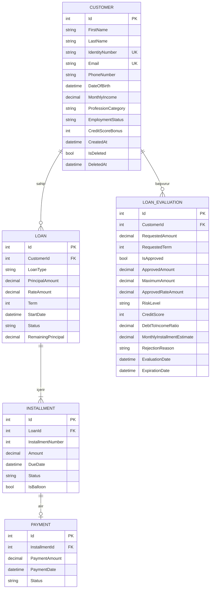
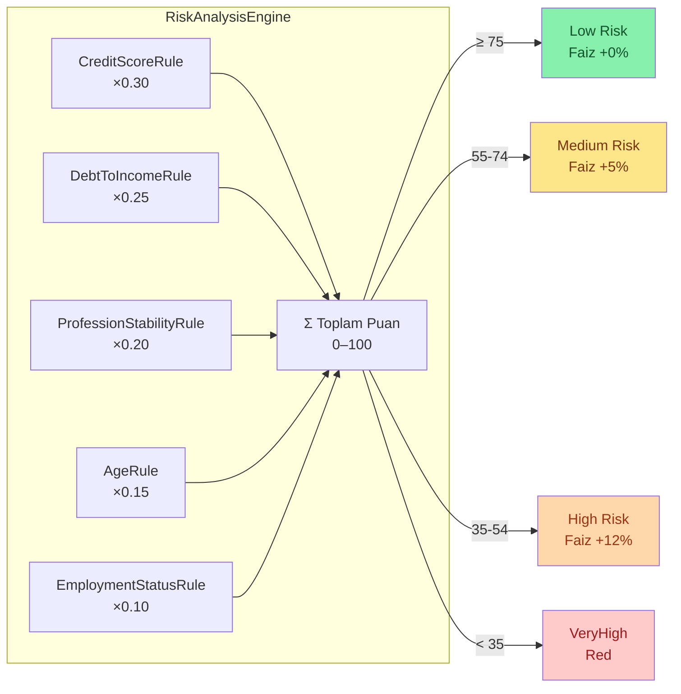
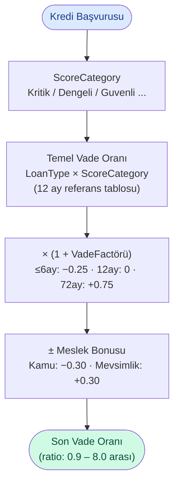
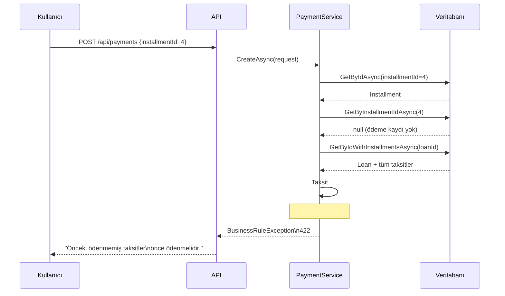
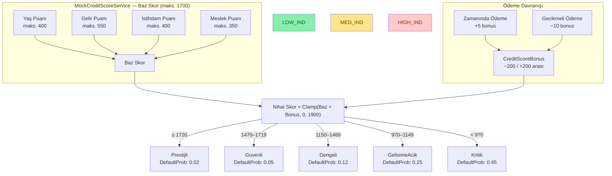
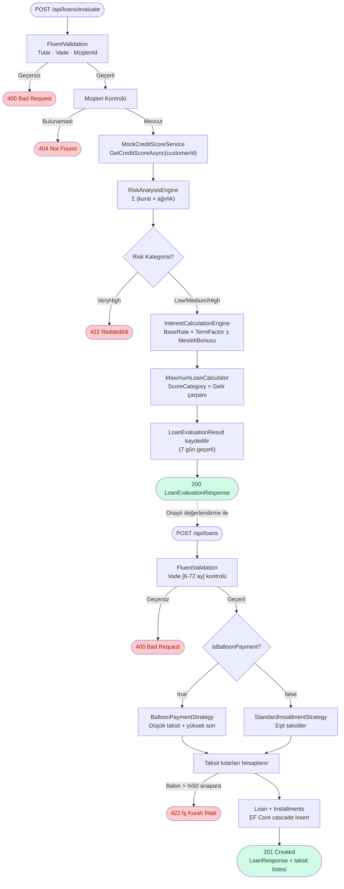
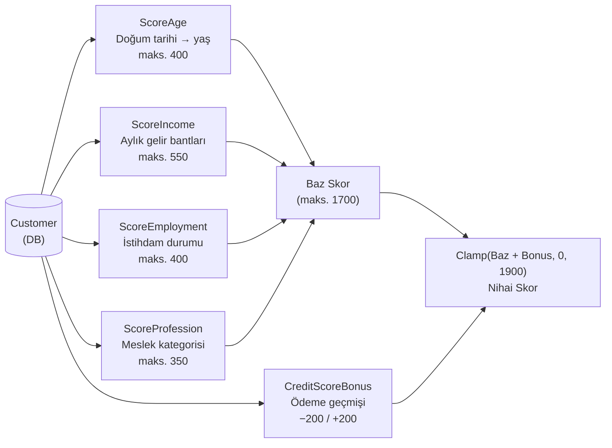

# Digital Loan & Repayment Management System

Bireysel müşterilerin kredi başvurularını, kredi bakiyelerini ve geri ödeme planlarını yönetebildiği full-stack dijital bankacılık uygulaması.

---

## İçindekiler

1. [Teknoloji Stack'i](#teknoloji-stacki)
2. [Mimari](#mimari)
3. [Proje Yapısı](#proje-yapısı)
4. [Domain Modeli](#domain-modeli)
5. [ER Diyagramı](#er-diyagramı)
6. [İş Kuralları](#iş-kuralları)
7. [Kredi Değerlendirme Motoru](#kredi-değerlendirme-motoru)
8. [Vade Oranı Belirleme](#vade-oranı-belirleme)
9. [Taksit Hesaplama](#taksit-hesaplama)
10. [Sıralı Ödeme Kuralı](#sıralı-ödeme-kuralı)
11. [Balon Ödeme](#balon-ödeme)
12. [Kredi Skoru Dinamiği](#kredi-skoru-dinamiği)
13. [Kredi Oluşturma Akışı](#kredi-oluşturma-akışı)
14. [API Endpoint Listesi](#api-endpoint-listesi)
15. [Hata Yönetimi](#hata-yönetimi)
16. [Üçüncü Parti Servis Entegrasyonu](#üçüncü-parti-servis-entegrasyonu)
17. [Kurulum ve Çalıştırma](#kurulum-ve-çalıştırma)
    > **Mock servislerin detaylı açıklaması için:** [`MockServices.md`](./MockServices.md)
18. [Geliştirme Adımları](#geliştirme-adımları)
19. [Yapay Zeka Kullanımı](#yapay-zeka-kullanımı)

---

## Teknoloji Stack'i

### Backend

| Katman | Teknoloji |
|---|---|
| Framework | .NET 10 / ASP.NET Core Web API |
| Dil | C# |
| ORM | Entity Framework Core 10 |
| Veritabanı | Microsoft SQL Server 2022 |
| Validasyon | FluentValidation 11 |
| API Dokümantasyonu | Swagger / OpenAPI (Swashbuckle) |
| Container | Docker |
| Test | xUnit · Moq · FluentAssertions |
| Versiyon Kontrolü | Git — Conventional Commits |

### Frontend

| Katman | Teknoloji |
|---|---|
| Framework | React 18 |
| Dil | TypeScript (`erasableSyntaxOnly`) |
| Build | Vite |
| CSS | Tailwind CSS v4 (`@tailwindcss/vite`) |
| Routing | React Router v6 |
| HTTP | Axios + global interceptor |
| Toast | react-hot-toast |

---

## Mimari

Projede **Clean Architecture** yaklaşımı uygulanmıştır. Katmanlar yalnızca içe doğru bağımlılık kurar; dış katmanlar iç katmanları referans alır, tersi geçerli değildir.

```
┌─────────────────────────────────────────────────────┐
│                   CreditCase.Api                    │
│         Controllers │ Middleware │ Program.cs       │
│                                                     │
│  ┌───────────────────────────────────────────────┐  │
│  │           CreditCase.Application              │  │
│  │   Services │ DTOs │ Interfaces │ Validators   │  │
│  │                                               │  │
│  │  ┌─────────────────────────────────────────┐  │  │
│  │  │          CreditCase.Domain              │  │  │
│  │  │      Entities │ Enums │ Business Rules  │  │  │
│  │  └─────────────────────────────────────────┘  │  │
│  └───────────────────────────────────────────────┘  │
│                                                     │
│  ┌───────────────────────────────────────────────┐  │
│  │         CreditCase.Infrastructure             │  │
│  │  AppDbContext │ Repositories │ Mock Services  │  │
│  └───────────────────────────────────────────────┘  │
└─────────────────────────────────────────────────────┘
```

### Bağımlılık Kuralı

```
Api  →  Application  →  Domain
Infrastructure  →  Application  →  Domain
```

`Domain` hiçbir dış katmana bağımlı değildir. `Application`, yalnızca `Domain`'i tanır. `Infrastructure`, `Application` interface'lerini implement eder; bu sayede gerçek EF Core implementasyonu uygulama katmanından gizlenir.

---

## Proje Yapısı

```
CreditCase.sln
│
├── CreditCase.Domain/
│   ├── Entities/
│   │   ├── Customer.cs          # IsDeleted / DeletedAt (soft delete) + CreditScoreBonus
│   │   ├── Loan.cs
│   │   ├── Installment.cs       # IsBalloon bayrağı
│   │   ├── Payment.cs
│   │   └── LoanEvaluationResult.cs
│   ├── Enums/
│   │   ├── LoanType.cs
│   │   ├── LoanStatus.cs
│   │   ├── InstallmentStatus.cs
│   │   ├── PaymentStatus.cs
│   │   ├── RiskCategory.cs
│   │   ├── ScoreCategory.cs         # 5 kategori: Kritik/GelisimeAcik/Dengeli/Guvenli/Prestijli
│   │   ├── ScoreCategoryHelper.cs   # Kategori → çarpan, vade limiti, min. taksit, risk eşleşmesi
│   │   ├── ProfessionCategory.cs
│   │   └── EmploymentStatus.cs
│   └── Interfaces/
│       └── IRiskAnalysisRule.cs
│
├── CreditCase.Application/
│   ├── DTOs/
│   │   ├── Customers/   (CreateCustomerRequest, UpdateCustomerRequest, CustomerResponse, CustomerSummaryResponse)
│   │   ├── Loans/       (CreateLoanRequest, LoanResponse, LoanApplicationRequest, LoanEvaluationResponse)
│   │   ├── Installments/(UpdateInstallmentRequest, InstallmentResponse)
│   │   └── Payments/    (CreatePaymentRequest, PaymentResponse)
│   ├── Interfaces/
│   │   ├── Repositories/(ICustomerRepository, ILoanRepository, ...)
│   │   ├── Services/    (ICustomerService, ILoanService, IRiskAnalysisService,
│   │   │                 IInterestCalculationService, IMaximumLoanCalculatorService,
│   │   │                 IInstallmentPlanStrategy, ILoanEvaluationService)
│   │   └── External/    (ICreditScoreService)
│   ├── Services/
│   │   ├── CustomerService.cs
│   │   ├── LoanService.cs
│   │   ├── LoanEvaluationService.cs
│   │   ├── InstallmentService.cs
│   │   └── PaymentService.cs
│   ├── Validators/
│   │   ├── CreateCustomerRequestValidator.cs
│   │   ├── UpdateCustomerRequestValidator.cs
│   │   ├── CreateLoanRequestValidator.cs   # tutar-vade çapraz kural dahil
│   │   └── CreatePaymentRequestValidator.cs
│   ├── Exceptions/
│   │   ├── NotFoundException.cs
│   │   └── BusinessRuleException.cs
│   └── DependencyInjection.cs
│
├── CreditCase.Infrastructure/
│   ├── Persistence/
│   │   ├── AppDbContext.cs      # Global query filter, filtered unique indexes
│   │   └── Repositories/
│   │       ├── CustomerRepository.cs
│   │       ├── LoanRepository.cs
│   │       ├── InstallmentRepository.cs
│   │       ├── PaymentRepository.cs
│   │       └── LoanEvaluationRepository.cs
│   ├── Services/
│   │   ├── MockCreditScoreService.cs        # Profil tabanlı skor hesaplama (0-1900)
│   │   ├── RiskAnalysisEngine.cs            # Ağırlıklı kural motoru
│   │   ├── InterestCalculationEngine.cs     # Dinamik vade oranı (ratio, not %)
│   │   ├── MaximumLoanCalculator.cs         # ScoreCategory × gelir çarpanı
│   │   ├── StandardInstallmentStrategy.cs   # Amortisasyon yöntemi eşit taksit
│   │   ├── BalloonPaymentStrategy.cs        # Balon ödeme planı
│   │   └── Rules/
│   │       ├── CreditScoreRule.cs           # Ağırlık: 0.30
│   │       ├── DebtToIncomeRule.cs          # Ağırlık: 0.25
│   │       ├── ProfessionStabilityRule.cs   # Ağırlık: 0.20
│   │       ├── AgeRule.cs                   # Ağırlık: 0.15
│   │       └── EmploymentStatusRule.cs      # Ağırlık: 0.10
│   ├── Migrations/
│   │   ├── 20260511000000_InitialCreate.cs
│   │   ├── 20260511000002_AddSoftDeleteToCustomer.cs
│   │   ├── 20260512000001_AddCreditScoreBonusToCustomer.cs
│   │   └── 20260512000002_RenameInterestRateToRateAmount.cs
│   └── DependencyInjection.cs
│
├── CreditCase.Api/
│   ├── Controllers/
│   │   ├── CustomersController.cs
│   │   ├── LoansController.cs
│   │   ├── LoanEvaluationController.cs
│   │   ├── InstallmentsController.cs
│   │   └── PaymentsController.cs
│   ├── Middleware/
│   │   └── ExceptionHandlingMiddleware.cs
│   └── Program.cs
│
├── CreditCase.Tests/
│   ├── Services/
│   │   ├── CustomerServiceTests.cs   # 10 test (soft delete + borç kontrolü dahil)
│   │   ├── LoanServiceTests.cs       # 9 test
│   │   ├── InstallmentServiceTests.cs# 6 test
│   │   └── PaymentServiceTests.cs    # 8 test
│   └── Validators/
│       └── CustomerValidatorTests.cs # 15 test (TC + telefon validasyonu)
│
└── CreditCase.UI/                    # React frontend (bkz. CreditCase.UI/README.md)
    ├── src/
    │   ├── pages/     (Dashboard, Customers, Loans, Payments, ...)
    │   ├── services/  (Axios API katmanı)
    │   ├── components/(UI bileşenleri + layout)
    │   └── types/     (API DTO interface'leri)
    └── README.md
```

---

## Domain Modeli

### Customer

Bankanın bireysel müşterisini temsil eder.

| Alan | Tip | Açıklama |
|---|---|---|
| Id | int | Birincil anahtar |
| FirstName | string (100) | Ad |
| LastName | string (100) | Soyad |
| IdentityNumber | string (11) | TC Kimlik No — aktif kayıtlar arasında benzersiz |
| Email | string (200) | E-posta — aktif kayıtlar arasında benzersiz |
| PhoneNumber | string (20) | Telefon (10–11 hane, yalnızca rakam) |
| DateOfBirth | DateTime | Doğum tarihi — yaş puanı hesabında kullanılır |
| MonthlyIncome | decimal(18,2) | Aylık net gelir — risk ve maksimum tutar hesabında kullanılır |
| ProfessionCategory | enum | Kamu / Sağlık / Finans / Teknoloji / Eğitim / Ticaret / Hizmetler / İnşaat / Mevsimlik / Diğer |
| EmploymentStatus | enum | Tam Zamanlı / Yarı Zamanlı / Serbest / Emekli / İşsiz |
| CreditScoreBonus | int | Ödeme davranışından biriken bonus (−200 / +200 aralığı) |
| CreatedAt | DateTime | Kayıt tarihi |
| IsDeleted | bool | Soft delete bayrağı (varsayılan: false) |
| DeletedAt | DateTime? | Silinme tarihi (null = aktif kayıt) |

### Loan

Müşteriye verilen krediyi temsil eder.

| Alan | Tip | Açıklama |
|---|---|---|
| Id | int | Birincil anahtar |
| CustomerId | int | Bağlı müşteri (FK) |
| LoanType | enum | Bireysel / Eğitim / Taşıt |
| PrincipalAmount | decimal(18,2) | Ana para tutarı |
| RateAmount | decimal(7,4) | Vade oranı (ratio, yüzde değil) — InterestCalculationEngine tarafından belirlenir |
| Term | int | Vade (ay) |
| StartDate | DateTime | Kredi başlangıç tarihi |
| Status | enum | Aktif / Kapalı |
| RemainingPrincipal | decimal(18,2) | Ödenmemiş taksit tutarlarının toplamı |

### Installment

Krediye bağlı aylık ödeme planı kalemini temsil eder.

| Alan | Tip | Açıklama |
|---|---|---|
| Id | int | Birincil anahtar |
| LoanId | int | Bağlı kredi (FK) |
| InstallmentNumber | int | Taksit sıra numarası |
| Amount | decimal(18,2) | Taksit tutarı |
| DueDate | DateTime | Son ödeme tarihi |
| Status | enum | Unpaid / Paid / Overdue |
| IsBalloon | bool | Balon ödeme taksiti mi? |

### Payment

Gerçekleştirilen ödeme işlemini temsil eder.

| Alan | Tip | Açıklama |
|---|---|---|
| Id | int | Birincil anahtar |
| InstallmentId | int | Bağlı taksit (FK) — unique |
| PaymentAmount | decimal(18,2) | Ödeme tutarı |
| PaymentDate | DateTime | Ödeme tarihi |
| Status | enum | Başarılı / Başarısız |

### LoanEvaluationResult

Kredi başvurusu değerlendirme kaydını temsil eder.

| Alan | Tip | Açıklama |
|---|---|---|
| Id | int | Birincil anahtar |
| CustomerId | int | Bağlı müşteri (FK) |
| RequestedAmount | decimal(18,2) | İstenen kredi tutarı |
| RequestedTerm | int | İstenen vade (ay) |
| IsApproved | bool | Onay kararı |
| ApprovedAmount | decimal(18,2) | Onaylanan tutar |
| MaximumAmount | decimal(18,2) | Hesaplanan maksimum uygun tutar |
| ApprovedRateAmount | decimal(7,4) | Hesaplanan vade oranı (ratio) |
| RiskLevel | enum | Low / Medium / High / VeryHigh |
| CreditScore | int | Değerlendirme anındaki kredi skoru (0–1900) |
| CreditScoreCategory | enum | Kritik / GelisimeAcik / Dengeli / Guvenli / Prestijli |
| DebtToIncomeRatio | decimal | Borç / Gelir oranı |
| MonthlyInstallmentEstimate | decimal(18,2) | Tahmini aylık taksit |
| RejectionReason | string? | Red sebebi (yalnızca reddedilen başvurularda) |
| EvaluationDate | DateTime | Değerlendirme tarihi |
| ExpirationDate | DateTime | Onay geçerlilik tarihi (7 gün) |

---

## ER Diyagramı



**İlişkiler:**
- `Customer` → `Loan` : 1'e N (bir müşterinin birden fazla kredisi olabilir)
- `Customer` → `LoanEvaluation` : 1'e N (değerlendirme geçmişi korunur)
- `Loan` → `Installment` : 1'e N (bir kredi birden fazla taksit içerir)
- `Installment` → `Payment` : 1'e 0..1 (her taksit en fazla bir ödemeye sahip olabilir)

---

## İş Kuralları

### Müşteri Yönetimi
- TC Kimlik Numarası ve e-posta **aktif kayıtlar** arasında benzersiz olmalıdır.
- Silme işlemi **soft delete** ile yapılır: kayıt fiziksel olarak silinmez, `IsDeleted = true` ve `DeletedAt` set edilir. Kredi ve ödeme geçmişi korunur.
- EF Core global query filter (`HasQueryFilter`) sayesinde soft-deleted kayıtlar tüm sorgularda otomatik olarak hariç tutulur.
- **Aktif borcu olan müşteri silinemez.** Tüm kredilerin kapanması şarttır; aksi hâlde `422` hatası döner.

### Kredi Oluşturma
- Kredi oluşturulmadan önce `LoanEvaluationService` üzerinden risk ve uygunluk analizi yapılır.
- Değerlendirme `Approved` değilse kredi reddedilir.
- Kredi kaydedilirken taksit planı **otomatik olarak** üretilir; ayrı bir endpoint çağrısı gerekmez.
- **Vade Kısıtı:** Desteklenen vadeler `[6, 12, 18, 24, 36, 48, 60, 72]` aydır; diğer değerler 400 döner.
- **Kategori Bazlı Vade Sınırı:** Müşterinin `ScoreCategory`'si her kategorinin maksimum vadesini belirler (Kritik=24 ay, Prestijli=72 ay). İstenen vade bu sınırı aşarsa sistem otomatik olarak en yakın sınıra çeker.

### Taksit Yönetimi
- Her taksit, vade tarihi (`DueDate`) taşır.
- `GET /api/installments` çağrıldığında sistem, `DueDate` geçmiş ve `Unpaid` durumundaki taksitleri otomatik olarak `Overdue` olarak günceller.

### Ödeme Yönetimi
- Aynı taksit için ikinci ödeme oluşturulamaz (çift koruma — bkz. [Sıralı Ödeme Kuralı](#sıralı-ödeme-kuralı)).
- `Paid` statüsündeki bir taksit için ödeme yapılamaz.
- **Sıralı ödeme zorunludur:** önceki ödenmemiş taksit varken ileri taksit ödenemez.
- Başarılı ödeme sonrası:
  1. Taksit durumu `Paid` olarak güncellenir.
  2. Kredinin `RemainingPrincipal` değeri yeniden hesaplanır.
  3. Tüm taksitler ödenmiş ise kredi durumu `Closed` olarak işaretlenir.
  4. Müşterinin `CreditScoreBonus` değeri güncellenir (+5 zamanında, −10 gecikmiş).

---

## Kredi Değerlendirme Motoru

Kredi başvurusu `POST /api/loans/evaluate` ile değerlendirilir. Onaylanan değerlendirme ID'si ile `POST /api/loans` çağrısında kredi oluşturulur.

### Risk Analizi — Ağırlıklı Kural Motoru

`RiskAnalysisEngine`, `IRiskAnalysisRule` interface'ini implement eden 5 bağımsız kural sınıfını toplayan bir motor çalıştırır. Her kural 0–100 arası puan üretir ve kendi ağırlığıyla çarpılır:

```
Toplam Puan = Σ (Kural[i].Evaluate() × Kural[i].Weight)
```

| Kural | Ağırlık | Puan Kaynağı |
|---|---|---|
| `CreditScoreRule` | 0.30 | Kredi skoru 0-1900 → 0-100 normalize |
| `DebtToIncomeRule` | 0.25 | Borç/Gelir oranı bantları |
| `ProfessionStabilityRule` | 0.20 | Meslek kategorisine göre stabilite |
| `AgeRule` | 0.15 | Yaş bantları (36-50 = 100 puan) |
| `EmploymentStatusRule` | 0.10 | İstihdam durumu |

Risk kategorisi toplam puana göre belirlenir:

| Toplam Puan | Risk Kategorisi | Faiz Etkisi |
|---|---|---|
| ≥ 75 | Düşük (Low) | Risk primi: +0% |
| ≥ 55 | Orta (Medium) | Risk primi: +5% |
| ≥ 35 | Yüksek (High) | Risk primi: +12% |
| < 35 | Çok Yüksek (VeryHigh) | Başvuru reddedilir |



### Maksimum Kredi Tutarı

Maksimum tutar, müşterinin `ScoreCategory`'sine göre belirlenen gelir çarpanı ile hesaplanır:

| ScoreCategory | Gelir Çarpanı | Maks. Vade | Min. Taksit |
|---|---|---|---|
| Kritik | Kredi verilmez (0×) | 24 ay | — |
| GelisimeAcik | 3× | 36 ay | 25.000 ₺ |
| Dengeli | 10× | 48 ay | 15.000 ₺ |
| Guvenli | 15× | 60 ay | 10.000 ₺ |
| Prestijli | 20× | 72 ay | 5.000 ₺ |

```
BorçKapasitesi   = (AylıkGelir × 0.70) − MevcutAylıkBorçÖdemesi
KapasiteBazlıMax = BorçKapasitesi × EfektifVade
GelirBazlıMax    = AylıkGelir × Çarpan
MaksimumTutar    = Min(GelirBazlıMax, KapasiteBazlıMax, 1.000.000 ₺)
```

---

## Vade Oranı Belirleme

Vade oranı, `InterestCalculationEngine` tarafından 3 aşamada dinamik olarak hesaplanır. Sonuç **ratio formatındadır** (örn. `3.25`, `4.48`) — yüzde değildir, UI'de `%` kullanılmaz. Detaylı açıklama için bkz. [`MockServices.md`](./MockServices.md).

### Formül

```
Son Vade Oranı = TemelOran × (1 + VadeFactörü) ± MeslekBonusu
```

### Aşama 1 — Temel Vade Oranı (LoanType × ScoreCategory, 12 ay referans)

| | Kritik | GelisimeAcik | Dengeli | Guvenli | Prestijli |
|---|---|---|---|---|---|
| **Bireysel** | 6.8 | 5.2 | 4.0 | 3.0 | 2.0 |
| **Taşıt** | 5.8 | 4.2 | 3.0 | 2.0 | 1.2 |
| **Eğitim** | 5.2 | 3.8 | 2.7 | 1.7 | 0.9 |

### Aşama 2 — Vade Faktörü

| Vade | Faktör |
|---|---|
| ≤ 6 ay | −0.25 (indirim) |
| ≤ 12 ay | 0.00 (referans) |
| ≤ 18 ay | +0.08 |
| ≤ 24 ay | +0.15 |
| ≤ 36 ay | +0.28 |
| ≤ 48 ay | +0.42 |
| ≤ 60 ay | +0.58 |
| ≤ 72 ay | +0.75 |

### Aşama 3 — Meslek Bonusu / Penaltısı

| Meslek | Etki |
|---|---|
| Kamu | −0.30 |
| Sağlık, Teknoloji | −0.20 |
| Eğitim | −0.15 |
| Finans | −0.10 |
| Ticaret, İnşaat | +0.20 |
| Mevsimlik | +0.30 |
| Serbest Meslek (EmploymentStatus) | min. +0.30 |

### Örnek Hesaplamalar

**Senaryo A — Güvenli Kategorisi, Yazılımcı, 24 ay:**
```
Kredi Skoru: 1550 → Guvenli
Temel Oran (Bireysel, Guvenli): 3.0
Vade Faktörü (24 ay): +0.15  →  3.0 × 1.15 = 3.45
Meslek Bonusu (Teknoloji): −0.20
Son Vade Oranı = 3.45 − 0.20 = 3.25
```

**Senaryo B — Dengeli Kategorisi, Satış, 36 ay:**
```
Kredi Skoru: 1200 → Dengeli
Temel Oran (Bireysel, Dengeli): 4.0
Vade Faktörü (36 ay): +0.28  →  4.0 × 1.28 = 5.12
Meslek Bonusu (Ticaret): +0.20
Son Vade Oranı = 5.12 + 0.20 = 5.32
```



---

## Taksit Hesaplama

Faiz oranı belirlendikten sonra taksit planı iki strateji sınıfından biri ile üretilir.

### Standart Plan — `StandardInstallmentStrategy`

**Amortisasyon (azalan bakiye) yöntemiyle** eşit tutarlı taksit planı üretir:

```
r = rateAmount / 100 / 12   (yıllık ratio → aylık oran)
A = P × r(1+r)^n / [(1+r)^n − 1]

P = Anapara
r = Aylık oran
n = Vade (ay)
A = Aylık taksit tutarı
```

**Örnek:**
```
Ana Para: 50.000 ₺ · Vade Oranı: 3.30 · Vade: 24 ay

r = 3.30 / 100 / 12 = 0.00275
A = 50.000 × 0.00275 × (1.00275)^24 / [(1.00275)^24 − 1]
A ≈ 2.151 ₺/ay  (tüm taksitler eşit)

Toplam Ödeme ≈ 51.624 ₺  (ek ödeme: ~1.624 ₺)
```

`RemainingPrincipal`, her başarılı ödemede ödenmemiş taksit tutarlarının toplamıyla güncellenir:
```
RemainingPrincipal = SUM(ödenmemiş taksitlerin Amount değerleri)
```

### Balon Ödeme Planı — `BalloonPaymentStrategy`

Standart amortisasyon tutarının **%60**'ı kadar düşük ilk taksitler; kalan tüm borç son taksite (balon) yansıtılır:

```
regularAmount = ROUND(standardMonthlyAmount × 0.60, 2)
balloonAmount = ROUND(totalPayable − regularAmount × (term − 1), 2)
```

**Kısıt:** `balloonAmount ≤ principalAmount × 0.50` (anaparanın %50'sini aşamaz).

---

## Sıralı Ödeme Kuralı

Finansal tutarlılığı korumak amacıyla taksitler yalnızca küçükten büyüğe sırayla ödenebilir. Önceki ödenmemiş taksit varken ileri bir taksit ödenemez.



**Frontend davranışı:** Taksit planı ekranında yalnızca en düşük numaralı ödenmemiş taksitin yanında "Öde" butonu görünür; diğerleri "Önceki bekliyor" olarak gösterilir.

---

## Balon Ödeme

Balon ödeme, kredinin bir kısmını son aya erteleyerek ilk taksitlerde yük azaltan özel bir geri ödeme modelidir.

```mermaid
gantt
    title Standart vs Balon Ödeme Karşılaştırması (12 Ay, 20.000 ₺)
    dateFormat MM
    axisFormat Ay %m

    section Standart
    1.800 ₺/ay (×12) :01, 12M

    section Balon
    1.080 ₺/ay (×11) :01, 11M
    13.200 ₺ balon   :12, 1M
```



**Standart Kredi (20.000 ₺, %8, 12 ay):**

| Taksit | Tutar |
|---|---|
| 1–12 | 1.800 ₺ / ay |
| **Toplam** | **21.600 ₺** |

**Balon Ödemeli Kredi (aynı parametreler):**

| Taksit | Tutar |
|---|---|
| 1–11 | ~1.080 ₺ / ay (normalin %60'ı) |
| 12 (BALON) | ~13.720 ₺ |
| **Toplam** | **21.600 ₺** |

**Kısıtlamalar:** Yalnızca Taşıt (`Vehicle`) kredilerinde seçilebilir. Balon tutar anaparanın %50'sini aşarsa başvuru reddedilir.

---

## Kredi Skoru Dinamiği

Müşteri profili ve ödeme geçmişi, kredi skorunu birlikte belirler.



### Baz Skor Bileşenleri (toplam maks. 1700)

**Yaş Puanı (maks. 400):**

| Yaş | Puan |
|---|---|
| < 21 | 80 |
| 21–25 | 200 |
| 26–35 | 320 |
| 36–50 | 400 (pik) |
| 51–60 | 350 |
| 61–65 | 240 |
| > 65 | 110 |

**Gelir Puanı (maks. 550):**

| Aylık Gelir | Puan |
|---|---|
| < 3.000 ₺ | 60 |
| 3.000–5.999 ₺ | 170 |
| 6.000–9.999 ₺ | 290 |
| 10.000–19.999 ₺ | 410 |
| 20.000–49.999 ₺ | 495 |
| ≥ 50.000 ₺ | 550 |

**İstihdam Puanı (maks. 400):**

| Durum | Puan |
|---|---|
| Tam Zamanlı | 400 |
| Emekli | 340 |
| Serbest Meslek | 260 |
| Yarı Zamanlı | 200 |
| İşsiz | 40 |

**Meslek Puanı (maks. 350):**

| Meslek | Puan |
|---|---|
| Kamu | 350 |
| Sağlık | 315 |
| Finans | 295 |
| Eğitim / Teknoloji | 280 |
| Ticaret | 220 |
| Hizmetler | 195 |
| Diğer | 175 |
| İnşaat | 150 |
| Mevsimlik | 90 |

### Ödeme Geçmişi Bonusu

Her başarılı ödeme sonrası `CreditScoreBonus` güncellenir ve `Customer` tablosunda kalıcı olarak saklanır:

```csharp
bool isOnTime = installment.DueDate.Date >= DateTime.UtcNow.Date;
int delta     = isOnTime ? +5 : -10;
customer.CreditScoreBonus = Math.Clamp(customer.CreditScoreBonus + delta, -200, +200);
// Nihai skor = Math.Clamp(baseScore + CreditScoreBonus, 0, 1900)
```

Düzenli ödeme yapan bir müşteri zaman içinde kredi skorunu artırabilir; bu da sonraki başvurularda daha iyi faiz oranına yol açar.

---

## Kredi Oluşturma Akışı



---

## API Endpoint Listesi

### Customers

| Method | Endpoint | Açıklama | Başarı Kodu |
|---|---|---|---|
| GET | `/api/customers` | Tüm müşterileri listele | 200 |
| GET | `/api/customers/{id}` | Müşteriyi ID ile getir | 200 |
| GET | `/api/customers/{id}/summary` | Müşterinin borç özetini getir | 200 |
| POST | `/api/customers` | Yeni müşteri oluştur | 201 |
| PUT | `/api/customers/{id}` | Müşteri bilgilerini güncelle | 200 |
| DELETE | `/api/customers/{id}` | Müşteriyi soft-delete et (aktif borç varsa 422) | 204 |

### Loan Evaluation

| Method | Endpoint | Açıklama | Başarı Kodu |
|---|---|---|---|
| POST | `/api/loans/evaluate` | Kredi başvurusunu değerlendir (risk + faiz hesabı) | 200 |
| GET | `/api/loans/maximum-eligibility/{customerId}` | Müşterinin maksimum uygun kredi tutarını getir | 200 |
| GET | `/api/loans/evaluation/{evaluationId}` | Değerlendirme kaydını getir | 200 |
| GET | `/api/customers/{customerId}/evaluations` | Müşteriye ait değerlendirme geçmişini getir | 200 |

### Loans

| Method | Endpoint | Açıklama | Başarı Kodu |
|---|---|---|---|
| GET | `/api/loans` | Tüm kredileri listele | 200 |
| GET | `/api/loans/{id}` | Krediyi taksit detaylarıyla getir | 200 |
| POST | `/api/loans` | Kredi oluştur (taksit planı otomatik üretilir) | 201 |

### Installments

| Method | Endpoint | Açıklama | Başarı Kodu |
|---|---|---|---|
| GET | `/api/installments` | Tüm taksitleri listele (overdue günceller) | 200 |
| GET | `/api/installments/{id}` | Taksiti getir | 200 |
| PUT | `/api/installments/{id}` | Taksit durumunu güncelle | 200 |

### Payments

| Method | Endpoint | Açıklama | Başarı Kodu |
|---|---|---|---|
| GET | `/api/payments` | Tüm ödemeleri listele | 200 |
| POST | `/api/payments` | Ödeme gerçekleştir | 201 |

---

## Hata Yönetimi

Tüm hata senaryoları `ExceptionHandlingMiddleware` tarafından yakalanır ve tutarlı bir JSON formatında döner.

### Hata Tipleri ve HTTP Kodları

| Durum | HTTP Kodu | `type` Değeri |
|---|---|---|
| Kayıt bulunamadı | 404 | `NotFound` |
| İş kuralı ihlali | 422 | `BusinessRuleViolation` |
| Validasyon hatası | 400 | `ValidationError` |
| Sunucu hatası | 500 | `InternalServerError` |

### Örnek Yanıtlar

**404 Not Found:**
```json
{
  "type": "NotFound",
  "message": "99 numaralı müşteri bulunamadı."
}
```

**422 Business Rule Violation:**
```json
{
  "type": "BusinessRuleViolation",
  "message": "Bu taksit zaten ödenmiştir."
}
```

**422 Sıralı Ödeme İhlali:**
```json
{
  "type": "BusinessRuleViolation",
  "message": "Önceki ödenmemiş taksitler önce ödenmelidir."
}
```

**422 Aktif Borçlu Müşteri Silme:**
```json
{
  "type": "BusinessRuleViolation",
  "message": "Müşterinin 2 aktif kredisi ve toplam 45.000,00 TL borcu bulunmaktadır. Tüm borçlar kapatılmadan müşteri silinemez."
}
```

**400 Validation Error:**
```json
{
  "type": "ValidationError",
  "message": "Bir veya daha fazla validasyon hatası oluştu.",
  "errors": {
    "PrincipalAmount": ["Kredi tutarı 0'dan büyük olmalıdır."],
    "Term": ["Seçilen vade, 5000 TL kredi için uygun değil. Bu tutar için maksimum vade: 24 ay."]
  }
}
```

---

## Üçüncü Parti Servis Entegrasyonu

Kredi başvurusunda `ICreditScoreService` arayüzü üzerinden müşterinin kredi skoru sorgulanır. Arayüz `Application` katmanında tanımlıdır; implementasyon `Infrastructure` katmanındadır. Gerçek servis entegrasyonu gerektiğinde yalnızca `MockCreditScoreService` sınıfı değiştirilir — `LoanEvaluationService` hiçbir değişiklik gerektirmez (Açık/Kapalı Prensibi).

### Interface Tanımı

```csharp
// CreditCase.Application/Interfaces/External/ICreditScoreService.cs
public interface ICreditScoreService
{
    Task<CreditScoreResult> GetCreditScoreAsync(int customerId);
}

public record CreditScoreResult(
    int CustomerId,
    int CreditScore,              // 0-1900
    string RiskIndicator,         // "Low" | "Medium" | "High" | "VeryHigh"
    IReadOnlyList<NegativeRecord> NegativeRecords,
    decimal DefaultProbability,   // 0.0-1.0
    DateTime QueryDate
);
```

### Mock Implementasyon — Profil Tabanlı Skor

`MockCreditScoreService`, rastgele değer üretmek yerine müşterinin gerçek profilinden skor hesaplar. Bu sayede aynı profil her zaman aynı skoru üretir (deterministik) ve test edilebilir sonuçlar elde edilir.



**Mock servis yanıtı (örnek — 1550 skorlu, Güvenli kategorisi müşteri):**
```json
{
  "customerId": 3,
  "creditScore": 1550,
  "riskIndicator": "Low",
  "negativeRecords": [],
  "defaultProbability": 0.05,
  "queryDate": "2026-05-12T10:00:00Z"
}
```

**Mock servis yanıtı (örnek — 980 skorlu, Gelişime Açık kategorisi müşteri):**
```json
{
  "customerId": 7,
  "creditScore": 980,
  "riskIndicator": "High",
  "negativeRecords": [
    {
      "recordType": "Payment Late",
      "recordDate": "2025-11-12T00:00:00Z",
      "amount": 1200.00
    }
  ],
  "defaultProbability": 0.25,
  "queryDate": "2026-05-12T10:00:00Z"
}
```

---

## Kurulum ve Çalıştırma

### Gereksinimler

- .NET 10 SDK
- Docker
- Node.js ≥ 20

### 1. SQL Server'ı başlat

```bash
docker run -e "ACCEPT_EULA=Y" \
           -e "SA_PASSWORD=StrongPass123!" \
           -p 1433:1433 \
           --name sqlserver \
           -d mcr.microsoft.com/mssql/server:2022-latest
```

### 2. Veritabanı migration'ını uygula

```bash
dotnet ef database update \
  --project CreditCase.Infrastructure \
  --startup-project CreditCase.Api
```

### 3. Backend'i başlat

```bash
dotnet run --project CreditCase.Api
```

Backend varsayılan olarak `http://localhost:5285` adresinde çalışır.  
Swagger arayüzü: `http://localhost:5285/swagger`

### 4. Frontend'i başlat

```bash
cd CreditCase.UI
npm install
cp .env.example .env   # VITE_API_URL değerini backend portuna göre düzenle
npm run dev
```

Frontend `http://localhost:5173` adresinde çalışır. Ayrıntılı kurulum için bkz. [`CreditCase.UI/README.md`](./CreditCase.UI/README.md).

### Birim testleri

```bash
dotnet test CreditCase.Tests
```

### Bağlantı Dizesi

`CreditCase.Api/appsettings.json` dosyasında tanımlıdır:

```json
{
  "ConnectionStrings": {
    "DefaultConnection": "Server=localhost,1433;Database=CreditCaseDb;User Id=sa;Password=StrongPass123!;TrustServerCertificate=True;"
  }
}
```

---

## Geliştirme Adımları

Proje, Clean Architecture katman sırasına uygun ve bağımsız geliştirilebilir parçalar hâlinde ele alınmıştır.

### 1. Domain Katmanı — Temel Modelleme

`Customer`, `Loan`, `Installment`, `Payment`, `LoanEvaluationResult` entity'leri ile tüm enum'lar tanımlanmıştır. Entity ilişkileri navigation property'ler aracılığıyla kurulmuş; finansal alanlar için `decimal` tipi tercih edilmiştir.

### 2. Application Katmanı — İş Mantığı

Her entity için giriş (Request) ve çıkış (Response) DTO'ları oluşturulmuş; servis ve repository sözleşmeleri `Interfaces/` altında tanımlanmıştır. `FluentValidation` ile her request DTO için ayrı validator tanımlanmış; tutar-vade çapraz kural kontrolü de bu katmanda yer almaktadır.

### 3. Infrastructure Katmanı — Veri Erişimi ve Servisler

Beş adet risk kuralı (`CreditScoreRule`, `DebtToIncomeRule`, `ProfessionStabilityRule`, `AgeRule`, `EmploymentStatusRule`), `IRiskAnalysisRule` interface'i aracılığıyla `RiskAnalysisEngine`'e DI ile inject edilir. Yeni kural eklemek yalnızca yeni bir sınıf oluşturup DI'a kaydetmeyi gerektirir; engine kodu değişmez.

İki adet taksit planı stratejisi (`StandardInstallmentStrategy`, `BalloonPaymentStrategy`) `IInstallmentPlanStrategy` interface'ini implement eder.

### 4. API Katmanı — Sunum

Controller'lar enjekte edilen servis interface'lerini çağırır; herhangi bir iş mantığı içermez. `ExceptionHandlingMiddleware`, tüm exception türlerini yakalayarak tutarlı JSON hata formatına dönüştürür.

---

## Yapay Zeka Kullanımı

Bu projede yapay zeka destekli geliştirme yaklaşımı, belirli bir disiplin çerçevesinde uygulanmıştır.

| Alan | Kullanım Biçimi |
|---|---|
| Mimari tasarım | Clean Architecture katman sorumluluklarının belirlenmesinde referans olarak kullanıldı |
| Risk motoru tasarımı | Ağırlıklı kural motoru yaklaşımı tartışıldı; kuralların bağımsız sınıflara bölünmesi kararı AI önerisiyle şekillendi |
| Faiz hesaplama | Dinamik faiz bileşenleri (risk/vade/tutar primleri) ve gerçekçi Türk bankacılığı bantları AI ile belirlendi |
| Kredi skoru modelleme | 4 bileşenli profil bazlı skor algoritması AI ile tasarlandı; bantlar gerçek bankacılık referanslarına göre uyarlandı |
| EF Core konfigürasyonu | `HasPrecision`, `HasConversion<string>`, filtered unique index gibi konfigürasyon detayları AI yardımıyla hızlıca oluşturuldu |
| FluentValidation kuralları | Tutar-vade çapraz kural, TC/telefon format kuralları AI önerisiyle yazıldı ve domain'e uyarlandı |

### Kullanım Prensibi

AI çıktıları projeye doğrudan kopyalanmamıştır. Her çıktı şu süreçten geçirilmiştir:

1. **Analiz:** Üretilen kod veya yapı incelenerek ne yaptığı anlaşıldı.
2. **Domain uygunluğu kontrolü:** Bankacılık iş kurallarına ve projenin gereksinimlerine uyup uymadığı değerlendirildi.
3. **Uyarlama:** Gerektiğinde değiştirildi, eksik kısımlar tamamlandı, fazlalıklar çıkarıldı.
4. **Mimari tutarlılık:** Katmanlar arası bağımlılık kuralına ve Clean Architecture prensiplerine aykırılık oluşturup oluşturmadığı kontrol edildi.

Bu yaklaşımın temel amacı AI'ı bir üretkenlik aracı olarak kullanmak, çıktıyı kör bir şekilde kabul etmek değil; **AI çıktısını yönetme ve değerlendirme yetkinliğini** ortaya koymaktır.
